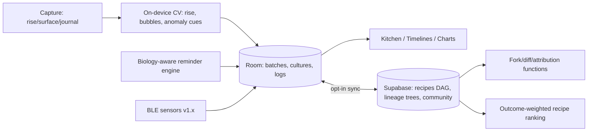

# Ferment — a lab notebook for living food

Somewhere in your kitchen, something is alive and you are responsible for it. Maybe it's a sourdough starter named Brenda, a jar of kimchi entering its funky adolescence, or a kombucha SCOBY that looks like a jellyfish and eats sugar like a teenager. Fermentation is the world's oldest biotechnology and its fastest-growing kitchen hobby, and its practitioners are running microbiology experiments with sticky notes and vibes. Ferment gives them what every living project deserves: a real lab notebook — batch timelines, feeding reminders, temperature and pH logs, photo journals — plus a computer-vision activity check for your starter, family trees for your cultures, and a community where recipes are forked and versioned like code. Because your kimchi *is* a repo.

## 1. Overview
- **Elevator pitch:** A batch-tracking companion for fermenters of everything — sourdough, kimchi, kombucha, miso, mead, hot sauce. Guided timelines with stage-aware reminders, environmental logs, photo journals, a CV-powered starter activity analyzer, culture lineage trees, and a fork-and-remix recipe community with attribution chains. Safety guidance built in, not bolted on.
- **Category:** Food & Drink / Lifestyle tool.
- **Tagline:** *A lab notebook for living food.*
- **Play Store positioning:** "Your sourdough has ancestors, your kimchi has versions, and your kitchen finally has a lab notebook."

## 2. Problem & Why Now
Fermentation exploded — sourdough was the pandemic's gateway drug, but the durable wave is bigger: gut-health culture made kimchi, kefir and kombucha supermarket categories; Noma's fermentation lab made koji a home-cook word; r/Sourdough (600k+), r/fermentation (1M+) and endless Discords overflow with the same three questions — *is this normal, when do I feed it, is this mold or yeast?* The tooling is nothing: notes apps, kitchen timers, and photo posts begging strangers for triage. The domain is genuinely tracking-shaped — every ferment is a multi-day process with stages, interventions, environmental variables, and outcomes worth comparing across attempts — precisely what software does well and paper does badly. Why now: phone cameras + on-device vision models can finally *measure* the things fermenters guess at (rise height over time, bubble activity, surface anomalies); Bluetooth kitchen thermometers/hygrometers are cheap and common; and the recipe-as-code culture (fork it, tweak the salt %, publish your version) already exists socially in these communities — it just has no software substrate. First mover in "GitHub for cultures" gets the community lock-in.

## 3. Target Audience & Personas
- **Hana, 29, software engineer, Seoul.** Third-generation kimchi maker gone quantitative: tracks salt percentages and fermentation days against her grandmother's taste memory. Ferment's versioning is built for her brain; her published "Halmoni's baechu, v7 (reduced salt, +pear)" with its attribution chain to v1 is exactly the artifact she wants to exist.
- **Greg, 52, high-school teacher, Portland.** Brenda (the starter) is six years old. He bakes weekends, kills his rhythm every school vacation, and needs the "reviving a neglected starter" flow more than he admits. The CV rise-tracker replaced the rubber band on his jar. Buys premium for multi-batch tracking during holiday bake season.
- **Priya, 35, nutrition-curious beginner, London.** Wants kombucha without dying (her words). The safety layer — clear go/no-go visuals of mold vs. healthy SCOBY, pH guidance, "when in doubt" rules — is why she chose Ferment over a notes app. Graduates to hot sauce in month three; the guided recipes ladder carried her.

## 4. Core Concept Deep-Dive
**The batch is the atom.** Everything in Ferment hangs off a *batch*: a living instance of a recipe, with a lifecycle. A batch has stages (kimchi: brine → pack → primary ferment → cold-store; mead: primary → rack → secondary → bottle → age), and each stage carries its own expected duration, reminders, and observations. The batch screen is a vertical timeline — part checklist, part diary: feedings logged, temperatures charted, photos in a consistent-angle series, tasting notes at milestones. When the batch ends, it gets an outcome card (rating, notes, "what I'd change") that feeds the next attempt. The genius of the timeline format is that it turns anxiety ("is it ready?") into orientation ("day 6 of 10, activity normal, taste-test scheduled Thursday").

**Reminders are stage-aware and honest about biology.** Not dumb timers: "Feed Brenda" recurs on her schedule but shifts with logged kitchen temperature (cold kitchen = slower metabolism = the app suggests stretching the interval); kimchi's "burp the jar" reminders cluster in the CO2-heavy first days then fade; a mead rack reminder waits on *your* logged gravity reading, not just the calendar. This is the difference between an app that knows fermentation and a to-do list wearing a chef's hat.

**The CV activity analyzer is the wow feature, scoped honestly.** Point the camera at your starter jar and Ferment measures what bakers already track manually: **rise height** (jar-line detection against a reference band — the digital rubber band), **bubble density and size distribution** (surface + side-wall analysis), and **trend over time** when you shoot from the consistent-angle guide (an AR ghost overlay of your last photo aligns each shot). Output is a plain activity read: "Rising steadily — roughly 1.8× in 4 hours, strong activity" plotted on the batch chart. For surface checks, a separate *triage assist* flags visual anomalies (fuzzy circular growths, pink/orange tints) as "worth a closer look" with reference imagery — always framed as decision support with conservative defaults, never as a verdict (see Safety). No lab claims, no pretending a camera is a microscope; the value is measurement discipline, not magic.

**Culture lineage is the soul feature.** Starters and SCOBYs are *cultures* — persistent entities that outlive batches and reproduce. Ferment models them with family trees: Brenda has a birthdate, a feeding history, descendants (the offshoot you gave Maria), and ancestors (the century-old Alaskan starter yours came from, if you know it). Gifting a culture generates a **culture card** — a QR/link that, when the recipient scans it, creates their linked descendant with the lineage attached. The tree view of a well-traveled starter — 40 descendants across 12 cities — is the single most shareable artifact in the app, and it converts every gifted jar into an install.

**Recipes fork like code.** A recipe is versioned: ingredients with baker's/salt percentages, stage plan, environmental targets. Publish it and others fork it; their changes are diffed ("−0.5% salt, +Asian pear, primary 4d → 3d") and attribution chains stay intact back to the origin. Browsing a popular kimchi recipe shows its family: 200 forks, the popular variants surfaced by outcome ratings from real batches — not votes, *outcomes*: "87% of 43 batches rated 4+". Recipe knowledge finally compounds instead of scattering across comment threads.

**Safety is a layer, not a lecture.** Species-appropriate guidance is embedded at the moments it matters: canning-adjacent and low-acid territory (garlic-in-oil, low-salt vegetable ferments) triggers explicit botulism-risk education with authoritative sourcing (USDA/NCHFP-derived), pH targets appear on relevant stage screens with cheap-strip instructions, and mold triage always ends with the conservative rule ("when in doubt, throw it out") stated without hedging. Categories with genuine hazard profiles (cured meats, low-acid canning) are deliberately out of scope at launch — the app says so and links to proper resources. This earns the trust that "fermentation app" needs and most food apps skip.

## 5. Complete Feature Set
**MVP (v1.0):**
- Batches with stage timelines, smart reminders, photo journal with consistent-angle ghost overlay, temperature/pH/gravity/salinity logging (manual), tasting notes, outcome cards.
- Cultures: profiles, feeding schedules with temperature-aware suggestions, lineage trees, gifting via culture cards.
- CV analyzer v1: rise tracking + bubble activity for starters (on-device), activity charting.
- Recipe engine: structured recipes with percentages, personal versions, batch-from-recipe with scaling (grams/jar-size calculator).
- Guided ladder: 12 authored starter recipes across sourdough, kimchi, kombucha, sauerkraut, hot sauce, mead with full stage plans and safety notes.
- Safety layer v1: category guidance, pH prompts, mold triage reference gallery.
**v1.x fast-follows:**
- Community: publish/fork/diff recipes with attribution chains and outcome-weighted browsing; batch journals shareable as beautiful timelines.
- Triage assist (anomaly flagging) after a dedicated dataset pass; Bluetooth sensor ingestion (common BLE thermometer/hygrometer protocols); widgets ("Brenda: feed today; Kimchi #4: day 6").
**v2.0+:**
- Multi-batch dashboards (holiday production mode), label printing (QR jar labels tying physical jars to batches), CSV/science export.
- Koji/miso/tempeh guided programs (incubation-focused, temperature-critical — worth doing right, hence v2).
- "Ask the batch" natural-language history search ("when did I last feed Brenda before a bake that scored 5?").

## 6. Screen-by-Screen UX Walkthrough
Navigation: bottom bar — **Kitchen** (active batches + cultures), **Recipes**, **Capture** (center camera button), **Community** (v1.x), **You**.
- **Kitchen:** cards for every living thing under your care: batches with stage/day badges and next-action lines ("burp tonight"), cultures with feeding status rings. The mental model: a ward round.
- **Batch timeline:** vertical stage timeline with logged events, charts (temp/pH/activity) expandable inline, photo series as a filmstrip (scrub to watch your kimchi change color across a week — quietly mesmerizing), action bar for log/photo/note.
- **Culture page:** portrait (yes, a portrait — your starter's hero shot), age, feeding history chart, descendants tree, gift button.
- **Capture:** camera with mode chips (rise check / surface check / journal photo), the alignment ghost, and instant analysis readout appended to the batch.
- **Recipes:** the ladder (guided, beginner-first) up top; your library; structured recipe view with percentage table, stage plan, scale-to-my-jar; "start batch" CTA.
- **Recipe diff view (v1.x):** side-by-side versions with changed lines highlighted — presented in kitchen language, not +/- hunks ("salt reduced to 2%; pear added at pack stage").
- **Community (v1.x):** browse by ferment type; recipe family trees; outcome-weighted sort; a "triage" board deliberately *not* built (medical-advice-shaped UGC is a moderation trap — reference gallery + safety pages instead).
**Key flow — first batch:** install → "what's alive in your kitchen?" (existing starter / starting fresh / just browsing) → existing: name it, photograph it, feeding schedule wizard; fresh: the ladder opens at sauerkraut ("the unkillable first ferment") → batch starts with day-1 tasks and the consistent-angle first photo → reminder rhythm begins. Time-to-value: under 3 minutes, and the day-3 "look at the bubbles" moment is the retention hook.
**Key flow — the rescue:** Greg returns from vacation to a sad jar → opens Brenda → "looks neglected?" quick action → revival protocol batch spins up (3-day feeding intensive with checkpoint photos) → the app's tone stays blame-free ("starters forgive; here's the road back") → Brenda's activity chart climbing over 3 days is the emotional payoff and the review-prompt moment.

## 7. Design Language
Warm laboratory: butcher-block and enamel-white surfaces, grid-paper texture in chart areas, glass-jar photography aesthetic; each ferment family gets an accent (sourdough ochre, kimchi chili-red, kombucha amber, mead honey-gold). Type: a sturdy serif for recipe headings (Fraunces again — kitchen-warm) with a precise sans for data and timelines; percentage tables set like lab tables, monospaced figures. Motion: gentle rises and settles (everything in this app is literally rising or settling); the activity chart draws with a yeasty spring. Sound: none needed; one soft jar-pop on batch completion. Iconography: line-drawn jars, crocks, airlocks — accurate to equipment (the community notices a wrong airlock). Photography guidance built into the design system: the consistent-angle ghost turns everyone's journal into a decent-looking series by default, which in turn makes every shared timeline an advertisement.

## 8. Technical Architecture
Opinionated stack: **Kotlin + Jetpack Compose**, offline-first with **Room**; every core feature (batches, reminders, CV, recipes) works without an account or a connection — kitchens have flour on hands, not Wi-Fi guarantees. CV: on-device via **MediaPipe/TFLite** — classical vision for rise measurement (jar-edge + level detection with the reference band), a compact trained model for bubble density/anomaly cues; consistent-angle alignment via feature matching against the previous frame. Reminder engine: WorkManager with biology-aware scheduling functions (temperature-adjusted intervals as pure, testable rules). Backend (accounts, community, lineage that spans users): **Supabase** — Postgres models the recipe-version DAG and culture family trees naturally (recursive CTEs for tree rendering); storage for photos (user-scoped, private by default); Edge Functions for fork/diff operations and outcome aggregation. Sensor ingestion (v1.x): BLE GATT for common thermometer/hygrometer profiles, logged into the batch stream like manual entries. Moderation for community content: text/image moderation pass + report queue; recipes are structured data, which shrinks the abuse surface versus free-text forums.

## 9. Data Model
- **Culture:** `id`, `name`, `type{sourdough|scoby|kefir|…}`, `born_at`, `parent_culture_id?`, `origin_story?`, `feeding_rule{interval_base, temp_adjust}`, `photos[]`, `owner_id`, `gifted_from_card?`.
- **Recipe:** `id`, `type`, `title`, `version`, `parent_recipe_id?` (the fork DAG), `ingredients[{name, amount, pct_basis}]`, `stages[{name, duration_expected, tasks[], targets{temp?, ph?, gravity?}}]`, `safety_flags[]`, `author_id`, `published:bool`.
- **Batch:** `id`, `recipe_id+version`, `culture_id?`, `started_at`, `stage_index`, `scale{jar_ml|flour_g}`, `state{active|complete|abandoned}`, `outcome{rating, notes, changes_next_time}?`.
- **LogEntry:** `batch_id`, `at`, `kind{feeding|temp|ph|gravity|photo|note|taste|burp|rack}`, `value?`, `photo_ref?`, `cv_result{rise_ratio?, bubble_score?, anomaly_flags[]}?`.
- **CultureCard:** `culture_id`, `token`, `claimed_by?`, `claimed_at?`.
- **OutcomeAggregate (derived):** `recipe_id`, `batches_n`, `rating_4plus_pct`, updated on completion events.

## 10. Monetization
Freemium subscription tuned to the hobby's natural intensity curve. **Free forever:** 2 active batches, 1 culture, full CV rise/bubble analyzer, the guided ladder, all safety content (safety is never paywalled — both ethics and liability posture), manual logging, personal recipes. **Ferment Pro — $3.99/month or $24.99/year** (₹129/mo, ₹799/yr): unlimited batches and cultures, lineage trees beyond direct parent/child, triage assist, BLE sensors, widgets, batch comparison views, full history export, holiday production dashboard. Community publishing/forking is free (network effects are worth more than gating them); an optional **Supporter badge** on published recipes ($1.99/mo, cosmetic + early features) monetizes the creators lightly without taxing the commons. Conversion logic: batch #3 is the natural wall (holiday bakers and enthusiasts hit it fast; casual單-batch users ride free happily as community demand-side), and the second culture (the day someone gifts you a SCOBY while you have a starter) is a converting life event the app literally witnesses via culture cards. Target: 4–6% of MAU on Pro by month 6; the India/SEA pricing tiers matter — fermentation is global and the app should be too. No ads: food-safety adjacency and programmatic ads is a nightmare pairing.

## 11. Play Store Listing
- **Title (≤30):** `Ferment: Sourdough & Kimchi` (27)
- **Short description (≤80):** `Batch timelines, smart reminders, starter tracking — a lab notebook for ferments.` (80)
- **Full description:** open with Brenda ("Somewhere in your kitchen, something is alive…"); blocks: Every Batch, Tracked (timelines, reminders that know biology), Point Your Camera at Your Starter (CV, honestly framed), Your Culture Has a Family Tree (lineage, gifting), Recipes That Fork (versioning, attribution), Safe Fermentation First (the layer, the conservative rules). Close with the ladder invitation ("start with the unkillable sauerkraut").
- **ASO keywords:** sourdough starter tracker, fermentation app, kimchi recipe, kombucha tracker, sourdough baking log, starter feeding reminder, fermenting vegetables, mead brewing log, scoby, bread baking journal.
- **Content rating:** Everyone. Community (v1.x) triggers UGC declarations with report/block.
- **Policy notes:** food-safety content must cite authoritative sources and avoid medical claims (gut-health marketing stays out of app copy — the wellness-claim line is real); CV triage framed as decision support, never diagnosis; Data safety: photos/logs user-scoped, community content public by explicit action only; no ads SDKs.

## 12. Growth & Marketing Plan
The communities are dense, generous, and starving for exactly this artifact set. (1) The culture card is the built-in loop: every gifted starter/SCOBY jar carries a QR that installs the app with lineage attached — seed it with a "gift kit" printable (jar label + card) that fermenters adore making; a starter with visible lineage becomes a tiny status object. (2) Reddit/Discord native launch: the rise-tracking demo GIF (jar, ghost overlay, chart drawing itself) is engineered for r/Sourdough's front page; moderator relationships and honest dev posts, never astroturf (same discipline as Sway). (3) Creator collabs: fermentation YouTube is authoritative and mid-sized (Joshua Weissman-adjacent through to Brad-Leone-energy channels; also the serious ones — Sourdough Journey, Fermented Homestead) — offer batch-journal embeds for their recipes: "follow this recipe as a live timeline in Ferment," which is genuinely useful content packaging for them. (4) Seasonality: January (gut-health resolutions), October–December (holiday bake/production season — Pro's natural harvest), plus kimjang season content for the Korean market done respectfully with native-speaker localization. (5) The lineage tree share: "Brenda's descendants, 40 jars, 12 cities" cards for anniversaries of a culture's birth. Retention marketing is the reminder system itself — every good reminder is a re-engagement no campaign could buy.

## 13. Analytics & KPIs
North star: **active batches per weekly-active user** (target ≥ 1.5) with the companion soul-metric **batch completion rate** (target ≥ 60% of started batches reach outcome — the app exists to carry people through). Key events: `batch_started{type, from_ladder}`, `stage_advanced`, `reminder_acted{kind}`, `cv_capture{mode}`, `rise_series_length` (the measurement habit forming), `culture_created/gifted/claimed`, `recipe_forked{depth}`, `outcome_recorded{rating}`, `pro_started{trigger: batch3|culture2|sensors}`, `rescue_flow_started`. Thresholds: D7 ≥ 35% (the day-3 bubbles must hook); reminder act-rate ≥ 50% (biology-aware scheduling proving itself vs. dumb timers); CV weekly use among starter-owners ≥ 40%; culture-card claim rate ≥ 30% of gifts; free→Pro ≥ 4%; safety-content views before first risky-category batch = 100% (enforced by flow, verified by funnel).

## 14. Risks & Mitigations
- **Someone gets sick and blames the app:** the deepest risk, handled structurally: conservative defaults, authoritative-source citations, hazardous categories excluded with signposting, triage-as-decision-support framing reviewed by a food-safety consultant (retainer, like Sway's clinical reviewer), and terms/disclaimers that match the in-app behavior. The app must always be *more* cautious than the average forum comment — that's both the moral bar and the brand.
- **CV overpromise:** rise/bubbles ship first because they're robustly measurable; anomaly triage waits for a real dataset (beta users contribute labeled photos opt-in); marketing shows charts, not verdicts.
- **Community moderation load:** structured recipes over free-text, no triage board, report queues, and outcome-weighting that buries junk without fights.
- **Scope explosion (fermentation is infinite):** the ladder defines supported-with-love categories; everything else works generically (custom stages) without bespoke guidance — the roadmap adds programs deliberately, koji before charcuterie, charcuterie possibly never.
- **Seasonal engagement troughs:** cultures (persistent, needy) smooth the batch seasonality; summer content (hot sauce, quick pickles) programs the trough.
- **Play policy:** wellness-claim discipline in every store asset; UGC declarations on community ship.

## 15. Competitive Landscape
- **Sourdough-specific apps (Rise, Sourdough Companion, various trackers):** single-vertical, timer-centric, no cultures-as-entities, no CV, no community substrate; Ferment's cross-ferment breadth + lineage + versioning is a different category that happens to include their feature set.
- **Brewfather / iBrewMaster (beer/mead):** excellent, deep, and intimidating — power tools for brewers with gravity math; Ferment overlaps only at mead's hobbyist edge and can integrate/export rather than compete on brewing science.
- **Notes apps + spreadsheets (the true incumbent):** infinitely flexible, zero structure, no reminders, no memory between attempts; every Ferment feature is a specific indictment of a sticky note.
- **r/Sourdough + Discords (the knowledge competitor):** where the questions go today; Ferment doesn't replace community wisdom — it gives it structure (recipes that fork, outcomes that aggregate) and should feel like those communities' missing tool, not their rival; the moderator-relations strategy reflects that.
- **MacGourmet/Paprika-style recipe managers:** static recipe filing; no lifecycle, no living things; adjacent purchase, different job.

## 16. Development Plan
Solo dev, ~24 weeks to v1.0. W1–3: batch/stage/log core + timeline UI (the ward-round Kitchen screen working end-to-end with manual data). W4–5: reminder engine with temperature-aware rules (pure functions, property-tested against fermentation-science references). W6–9: CV v1 — rise detection with the reference band + ghost alignment (the differentiator; a full month, tested across jar shapes, lighting, and flours), bubble scoring. W10–12: cultures, feeding schedules, lineage (local), gifting cards. W13–15: recipe engine with percentages/scaling + the ladder authored with a fermentation consultant and safety review (~$2k content budget, the best money in the plan). W16–17: safety layer integration, mold reference gallery (licensed/commissioned photography — quality matters precisely here). W18–20: closed beta with 300 fermenters recruited across sourdough/kimchi/kombucha communities; completion-rate and reminder-act telemetry drive tuning. W21–22: Pro IAP, widgets, polish, store assets (the rise-chart GIF is the hero). W23–24: buffer + launch (target early October — bake season's on-ramp). Community/fork system: the quarter after launch, gated on core retention proving out. **If behind:** cut BLE sensors and 4 ladder recipes — never cut the safety layer, CV rise tracking, or the consistent-angle ghost.

## 17. Moonshots
- **The Culture Atlas:** an opt-in world map of culture lineages — century-old starters' descendants glowing across continents; museum-grade data visualization and the app's definitive PR artifact ("the family tree of the world's sourdough").
- **Lab-grade companion hardware:** a jar-collar sensor (temp + headspace pressure + optical level) purpose-built for the app — the Oura ring for your starter; small-batch hardware with the same energy as Contact Sheet's shutter grip.
- **Institutional mode:** restaurant fermentation programs (Noma-lineage kitchens, breweries' wild programs) need HACCP-adjacent logging — a Pro-team tier where batch logs export to compliance formats; B2B revenue from the craft's high end.
- **The heirloom project:** partnerships with cultural institutions to document endangered traditional ferment lineages (village miso, regional kimchi styles) — recipes and oral histories (a Heirloom-app crossover of spirit) preserved with attribution and community consent.
- **Microbiome bridge:** partnerships with citizen-science sequencing projects letting curious users optionally sequence a culture sample and attach real strain data to its lineage tree — the moment the family tree becomes literal.
